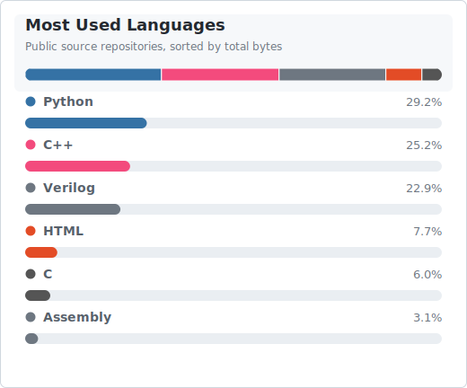

  <h1>Hi, I'm J1angJJ</h1>
  
<strong>Confusion is part of programming.</strong>

## About Me

- I am exploring robotics, automation, and practical software engineering.
- I am currently learning Python, C/C++, Linux, ROS, and machine learning workflows.
- I enjoy building tools that connect code with real-world systems.
- I use this profile to collect projects, notes, and experiments.
- Ask me about Python, Git, Linux, or developer tooling.

## GitHub Activity

<picture>
  <source media="(prefers-color-scheme: dark)" srcset="readme/resources/languages-dark.svg">
  <source media="(prefers-color-scheme: light)" srcset="readme/resources/languages.svg">
  
</picture>

The contribution snake below is generated from my GitHub activity and updated by GitHub Actions.

<picture>
  <source media="(prefers-color-scheme: dark)" srcset="readme/resources/grid-snake-dark.svg">
  <source media="(prefers-color-scheme: light)" srcset="readme/resources/grid-snake.svg">
  
</picture>

## Technologies and Interests

`Python` `C` `C++` `Linux` `ROS` `Git` `Docker` `PyTorch` `LaTeX` `Markdown` `VS Code`

## Connect

- GitHub: [@J1angJJ](https://github.com/J1angJJ)
- Profile repository: [J1angJJ/J1angJJ](https://github.com/J1angJJ/J1angJJ)
